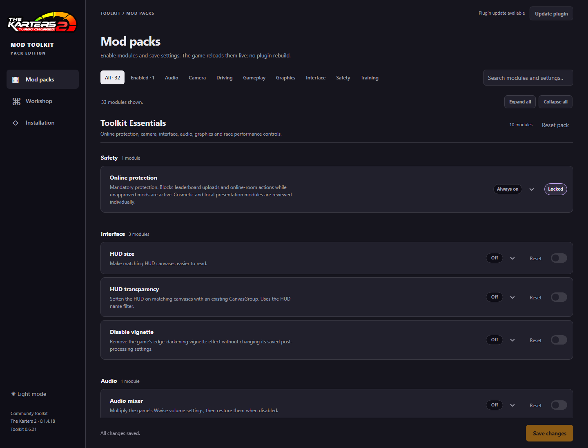
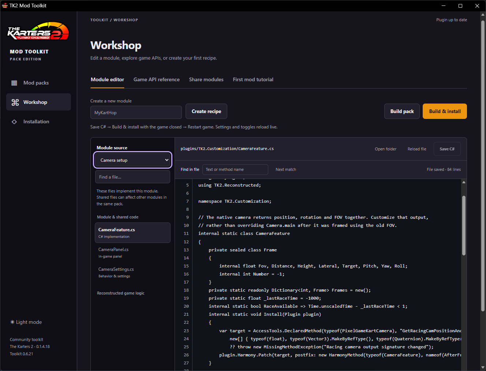
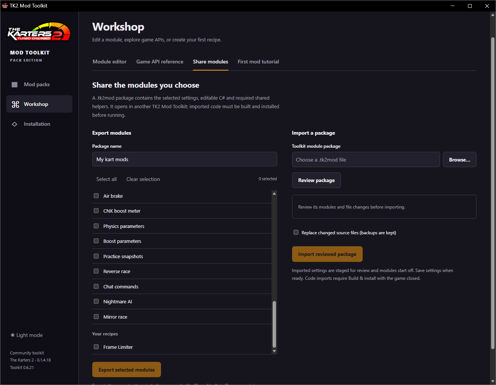
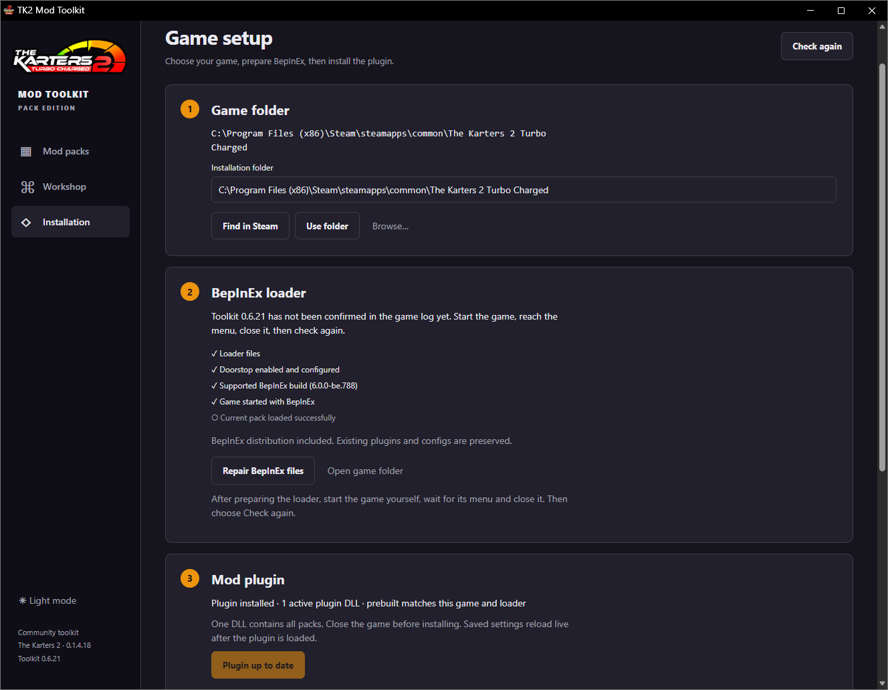

# TK2 Mod Toolkit

**A Windows toolkit for installing, configuring and authoring mods for The Karters 2 Turbo Charged.** It combines a local desktop-style app, one BepInEx IL2CPP plugin, a C# workshop and a growing set of evidence-backed reverse-engineering notes.

<p align="center"></p>

The supported game build is **0.1.4.18 (Windows x64)**. The validated loader is **BepInEx Unity IL2CPP x64 `6.0.0-be.788`**, commit `5b766a3`. This is a community project; gameplay-changing modules are intended for local/offline use. Online protection is mandatory and locked on.

## Toolkit screenshots

The screenshots below show the current Mod packs page and Workshop editor. The web UI adapts to the app window; controls and module catalog may change between toolkit builds.






## Install and use the application

For a ready-to-run copy, download the Windows x64 ZIP from [GitHub Releases](https://github.com/The-Karters-Community/TK2-Mod-Toolkit/releases), extract it to a writable folder and run **TK2 Mod Toolkit.exe**. Keep the extracted folder together. The app bundles Python and needs no Python or .NET installation to configure the prebuilt plugin. The game itself is not bundled.

In **Installation**, select the folder containing `TheKarters2.exe` and `GameAssembly.dll`. Install or repair the supported BepInEx build if needed, start the game yourself once so BepInEx can generate IL2CPP interop, then close the game and run **Check**. Install/update the Toolkit plugin only after the app reports the installation is ready. Existing plugin and config files are preserved; the app identifies possible conflicts and offers reversible disable/restore actions.

Open **Mod packs**, expand a module, enable it, adjust settings and select **Save changes**. Ordinary settings reload from `BepInEx/config/local.tk2.customization.cfg` while the game is running. Changing C# source is different: close the game, use **Build pack** or **Build & install**, then restart the game to load the rebuilt DLL. The module catalog, search, filters, resets, advanced settings and Workshop are described in [Application usage](docs/USAGE.md).

### Troubleshooting and uninstalling

If plugin installation is blocked, first check that the selected folder contains the expected game binaries, that BepInEx is the supported `6.0.0-be.788` build, and that the game is closed. After installing or repairing BepInEx, launch the game once to generate interop and a startup log, close it, then select **Check again**. For load errors, open **Installation → Build output & diagnostics** or inspect `BepInEx/LogOutput.log`.

To remove the Toolkit plugin, close the game and use **Installation → Backups & restore** to restore the transaction created when the Toolkit DLL was installed. This restores the previous DLL, or removes the Toolkit DLL if there was no previous file. Keep or remove the Toolkit config according to whether you want to retain settings; removing the plugin does not require deleting BepInEx or other mods. The app refuses to restore a file that changed after the backup.

## Run from a source checkout

On Windows, install **Python 3.10 or newer, 64-bit** and clone the repository. The application backend uses Python's standard library; a browser is opened as an app-style window when Edge is available, with a normal-browser fallback.

```powershell
git clone https://github.com/The-Karters-Community/TK2-Mod-Toolkit.git
cd TK2-Mod-Toolkit
python --version
python launch.py
```

You can also double-click **Launch Studio.cmd**. The source app uses this checkout's files directly, so changes to Python, HTML, CSS and JavaScript are visible on the next launch or page refresh. The app does not install or launch the game by itself.

To compile or install the plugin from source, also install a **.NET SDK that can target `net6.0`**, install the supported BepInEx build in the game, run the game once to generate interop assemblies, then close the game. Select the game in Installation and use **Build & install** in Workshop, or run `python -m studio.cli --game 'D:\Games\The Karters 2 Turbo Charged' build`. The plugin project requires game-specific interop references; build it through the Toolkit or this CLI rather than invoking `dotnet build` directly. A normal player using the prebuilt plugin does not need the .NET SDK.

## What is in this repository?

| Path | Purpose |
| --- | --- |
| `studio/` | Toolkit app: local HTTP backend, settings/catalog logic, release checker, and responsive HTML/CSS/JavaScript interface in `studio/web/`. |
| `plugins/TK2.Customization/` | The BepInEx plugin and its C# modules, hooks, online-safety policy, configuration handling and recipe host. |
| `src/Reconstructed/` | Small, readable C# semantic reconstructions of selected native game methods, adapters and provenance records. |
| `templates/` | Starter projects and examples for user-authored modules and recipes. |
| `tools/` | App packaging, release, Ghidra export, source audit and validation scripts. |
| `tests/` | Python backend tests, JavaScript UI-state tests, and focused C# logic/plugin-stub checks. |
| `assets/` | Toolkit branding and UI assets. |
| `docs/` | User guides, module notes, release/portable details, reverse-engineering evidence and known limitations. |
| `artifacts/` | Ignored build output: compiled plugin and portable app packages. Regenerate these locally; they are not checked into Git. |
| `local/`, `exports/` | Ignored machine-specific work: Ghidra projects, generated game data, captures, logs, backups and recovered third-party sources. Keep these out of commits. |

The top-level **`PRODUCT.md`** describes the application scope and **`DESIGN.md`** captures design direction. See [the documentation index](#guides-and-reference) for the main guides.

## Build the plugin and portable app

Double-click **Build Toolkit.cmd**, or run from PowerShell:

```powershell
# Build/reuse the plugin and create the default portable app ZIP
.\tools\build_toolkit.ps1

# Recompile the plugin from current C# source before packaging
.\tools\build_toolkit.ps1 -RebuildPlugin

# Optional: include the BepInEx distribution in the package
.\tools\build_toolkit.ps1 -IncludeLoader

# Non-default Steam/library or loader locations
.\tools\build_toolkit.ps1 -GamePath 'D:\Games\The Karters 2 Turbo Charged' `
  -LoaderPath 'D:\Modding\BepInEx-Unity.IL2CPP-win-x64-6.0.0-be.788+5b766a3'
```

The build requires Python 3.10+ x64, .NET SDK and an initialized supported game installation when the plugin must be compiled. Packaging dependencies are installed in the ignored `local/portable-build-env/` environment. The build does not deploy into the game or launch it.

The default artifact is a compressed, self-contained **application** ZIP at `artifacts/portable/TK2-Mod-Toolkit-<version>-win-x64.zip`; it bundles the app's Python runtime and prebuilt Toolkit plugin, but not the game or BepInEx. Users install the validated loader separately. `-IncludeLoader` creates the same package with BepInEx included. The portable build step also produces an unpacked app folder beside the ZIP.

## Tests and checks

From the repository root:

```powershell
python -m unittest discover -s tests -p 'test_*.py'
node tests/garage-state.test.cjs
```

The plugin's focused C# checks are separate projects under `tests/` (for example `dotnet run --project tests/ReadableLogic/ReadableLogic.csproj` and `dotnet run --project tests/OnlineProtection/OnlineProtection.csproj`). They compile against local stubs or extracted logic where documented. Use `python -m studio.cli build` with the initialized game's interop to validate a real plugin build. Passing automated checks proves only the behavior they cover; it does not replace in-game rendering, race, online-hook or clean-machine validation.

`python tools/smoke_gui.py` is an optional legacy Tk GUI smoke test. It also reads `MKsKartersMods.cfg` from a configured game installation; it currently stops if that file is absent. It does not launch the game.

## Releases and in-app updates

The updater is already configured for **`The-Karters-Community/TK2-Mod-Toolkit`**. At startup, a packaged copy checks that repository's latest stable GitHub Release. Source checkouts only point to the release page. The current installer accepts a newer release only when it has the exact asset name `TK2-Mod-Toolkit-<version>-win-x64.zip`, the matching portable manifest and updater script, and a valid SHA-256 digest from GitHub. It preserves the user's `local/` data and has rollback handling. A draft or prerelease is not offered as a stable update.

**The updater currently supports one full portable ZIP; it does not apply compact/delta updates.** Every release intended for in-app updates needs that exact ZIP and its `v<version>` tag. `tools/publish_release.ps1` checks that the versioned archive exists, the worktree is clean and the exact commit is pushed to `origin/main`; by default it creates a draft. Review the draft and publish it on GitHub to make it visible to the stable updater:

```powershell
# Create a draft release (recommended first step)
.\tools\publish_release.ps1

# Publish immediately instead of creating a draft
.\tools\publish_release.ps1 -Publish
```

The release version is set in `studio/version.py`. Build the archive after finalizing and committing the source. The script tags the current commit and uploads the ZIP. A release may use the default slim package or the larger loader-included package under the same required filename; the updater does not currently distinguish or offer two variants. See [release and update details](docs/RELEASING.md) and [portable packaging](docs/PORTABLE.md).

The repository has **no published GitHub releases as of October 10, 2026**, so the updater has not yet been validated against a real published asset. Once the first release is published with the expected tag and ZIP, test update discovery and installation from an older packaged build.

## Decompiled code and reverse-engineering evidence

There is **no complete, fully decompiled C# source tree** in this repository. The original game is a Unity IL2CPP build: Ghidra analyzes native `GameAssembly.dll` code, while generated interop assemblies mostly provide managed declarations and wrappers. Native pseudocode is not the original Unity project or original C# source.

The useful committed material is:

- [`src/Reconstructed/`](src/Reconstructed/) contains the selected readable C# behavior models, plugin-facing adapters and `provenance.json` linking work to binary hashes and addresses.
- [`docs/READABLE-SOURCE.md`](docs/READABLE-SOURCE.md) lists currently reconstructed methods, evidence and limitations.
- [`docs/RECONSTRUCTION.md`](docs/RECONSTRUCTION.md) explains the reconstruction workflow and incomplete areas.
- [`tools/ghidra/targets.txt`](tools/ghidra/targets.txt) and [`tools/ghidra/migration-targets.txt`](tools/ghidra/migration-targets.txt) define reproducible function export targets; `tools/ghidra/ExportTk2.java` is the Ghidra exporter.
- [`docs/REA-MIGRATION.md`](docs/REA-MIGRATION.md) summarizes recent REA findings and migration decisions.

The Workshop **Game API reference** is a searchable method/signature catalog; a listed signature does not mean that its body has been recovered. The bulk Ghidra project, native pseudocode exports, generated interop, raw dumps and third-party managed decompilations live under ignored `local/` or `exports/` paths when present on the maintainer's machine. In this checkout, the native index and its provenance are `local/ghidra/functions.jsonl` and `local/ghidra/summary.json`; exported Ghidra C-like pseudocode is in `local/ghidra/pseudocode/`. These are not distributed in Git. Ask the maintainer for the corresponding local evidence bundle if you need a specific function; do not treat the function index as a full source release.

## Guides and reference

| Topic | Guide |
| --- | --- |
| App setup and normal use | [Application usage](docs/USAGE.md), [application flow](docs/APPLICATION-FLOW.md) |
| Create a C# recipe | [First mod](docs/FIRST-MOD.md) |
| Share/import modules | [Share modules](docs/SHARING-MODULES.md), [community packs](docs/MOD-PACK.md) |
| Portable package and release process | [Portable packaging](docs/PORTABLE.md), [releases](docs/RELEASING.md) |
| Reverse engineering and source status | [Readable source](docs/READABLE-SOURCE.md), [reconstruction notes](docs/RECONSTRUCTION.md), [REA migration](docs/REA-MIGRATION.md) |
| Online safety | [Online protection policy](docs/ONLINE-PROTECTION.md) |
| Track-boundary inspector | [Track boundaries](docs/TRACK-BOUNDARIES.md) |
| Mirror camera | [Mirror race](docs/MIRROR-RACE.md) |
| Race FPS/RAM investigation | [Performance module](docs/PERFORMANCE-MOD.md), [investigation](docs/PERFORMANCE-INVESTIGATION-2026-10-09.md), [diagnostics](docs/PERFORMANCE-DIAGNOSTICS.md), [engine capture](docs/PERFORMANCE-ENGINE-CAPTURE.md) |
| Test history and current limitations | [Validation log](docs/VALIDATION.md), [roadmap](docs/ROADMAP.md) |

## Safety, scope and contributions

Online protection stays on and cannot be disabled in the app. It blocks leaderboard uploads and joining online rooms while unapproved mods are active. Only exact reviewed modules are allowlisted; physics, item, race-rule, information-advantage and user-authored code remain protected. The protection is a local client safeguard, not server-side anti-cheat or proof of publisher approval. Read [the policy](docs/ONLINE-PROTECTION.md) before changing the allowlist.

When adding a module, keep user settings and implementation in the existing catalog-driven structure, provide defaults/ranges and reset behavior, add focused regression coverage, and review its online-safety classification. Keep generated game data, decompiled third-party sources, captures and machine-local paths out of commits. Record binary version, hashes, evidence sources and limitations when adding native reconstruction. `AGENTS.md` contains repository-specific implementation and validation rules.

See [LICENSE](LICENSE) for the terms applying to this repository. Game files and any bundled third-party software keep their own licenses and are not relicensed by this project.

## Credits and disclosure

The Toolkit uses BepInEx Unity IL2CPP, Il2CppInterop and Harmony APIs; those projects and their licenses remain separate from this repository. The repository's [LICENSE](LICENSE) is All Rights Reserved and does not grant general permission to redistribute or modify the Toolkit. Game names, logos and game content are not owned by this project; the default portable build does not include the game or BepInEx distribution.

OpenAI Codex (GPT-6 series) provided AI coding and documentation assistance during development under the maintainer's direction. The maintainer remains responsible for review, testing, licensing and release decisions.
