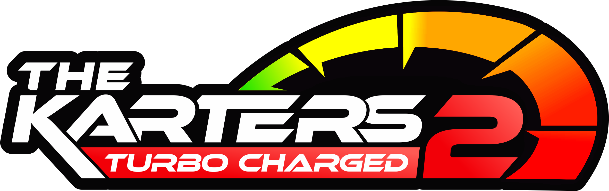

# TK2 Mod Toolkit

New: [Track boundaries](docs/TRACK-BOUNDARIES.md) selectively displays invisible-wall and respawn collider geometry. [Engine performance capture](docs/PERFORMANCE-ENGINE-CAPTURE.md) extends the race/time-trial investigation.



A Windows mod manager and C# workshop for **The Karters 2 Turbo Charged 0.1.4.18**. One BepInEx plugin, live settings, editable modules.

## Features

- Catalog-driven category filters and module groups within Toolkit Essentials, Community Mods and Your Recipes; detail controls render on demand for larger libraries.
- Per-value, module and pack resets; visible defaults, allowed ranges and interactive sliders.
- Live camera tuning with **F8**, plus interface, audio, graphics and driving controls.
- Camera-mirror racing for local offline races and time trials.
- Race performance: cached draw-distance arrays, optional race GC and native AI physics cadence for offline testing.
- C# editor, first-mod tutorial, game API browser and selective **.tk2mod** export/import.

## Get started

1. From this checkout, open **Launch Studio.cmd** (Python 3.10+, 64-bit). A portable distribution runs through **TK2 Mod Toolkit.exe**; keep its extracted files together.
2. Install the supported BepInEx build below, select the game folder in **Installation**, start the game once, wait for the menu, close it, then install/update the plugin.
3. In **Mod packs**, enable a module, adjust its settings and choose **Save changes**.

Settings reload live through `BepInEx/config/local.tk2.customization.cfg`. Changing C# requires **Build & install** with the game closed, followed by a game restart. Ordinary settings do not rebuild the plugin.

The source checkout runs with `Launch Studio.cmd` or `python launch.py` (Python 3.10+, 64-bit). Player installation from a portable package needs neither Python nor a .NET SDK; compiling custom C# needs a .NET SDK and initialized game interop.

## Prerequisites and compatibility

- **Game:** The Karters 2 Turbo Charged **0.1.4.18**, Windows x64.
- **Loader:** **BepInEx Unity IL2CPP x64 `6.0.0-be.788`**, built from commit `5b766a3b7f6c164d4798924a93f3acf4db769d06` (short SHA `5b766a3`). This is the verified loader build, including for installations that still use this older release. The Installation screen checks the BepInEx startup log and plugin build fingerprints before allowing installation; other loader builds must be rebuilt and validated against that installation.
- **Runtime validation:** Start the game once after installing BepInEx so it generates IL2CPP interop and a loader log. Then close it before installing or disabling plugin files. The Toolkit does not launch the game automatically.
- **Authoring:** A .NET SDK is needed to compile custom plugin code. A normal player install uses the prebuilt plugin and does not need the SDK.

The Installation screen lists plugin DLLs and other plugin configs. Other enabled plugins are marked as *possible* conflicts; a filename alone cannot prove they conflict. **Disable** renames a DLL to `.dll.disabled`, and **Disable config** renames a config to `.cfg.disabled`; neither deletes the file. These controls require the game to be closed. Disable one suspected plugin at a time, then re-test. Config files do not load code by themselves, and their plugin may regenerate a default config on launch. The Toolkit and BepInEx core configs are protected. Loader preparation preserves existing plugins and configs.

## Build the Windows app

Double-click **Build Toolkit.cmd**, or run:

```powershell
.\tools\build_toolkit.ps1 -RebuildPlugin
```

Requires Python 3.10+ (64-bit), a .NET SDK and the initialized game. Steam discovery supplies the game path; optional `-GamePath` and `-LoaderPath` arguments support other installations. Omit `-RebuildPlugin` to reuse the existing compiled plugin.

The default portable output is a slim compressed ZIP at `artifacts/portable/TK2-Mod-Toolkit-0.6.21-win-x64.zip`; it bundles the app runtime, not the 70+ MB BepInEx distribution. The recipient installs the loader prerequisite above separately. To make a larger self-contained package that can also prepare BepInEx, run `tools/build_toolkit.ps1 -IncludeLoader` (or add `--include-loader` to `tools/build_portable.py`). Both variants include the Python runtime, so players need no Python installation. The build script never installs into the game.

The app checks the GitHub Releases API at startup. A portable build can install a newer stable release after checking the release asset's GitHub SHA-256 digest, the archive paths, and the embedded version manifest. It stages the update beside the current app, preserves the `local` user-data folder, then swaps the app folder with rollback if the swap fails. A source checkout only opens the release page; it never overwrites developer files. There is no automatic update yet until the first matching release is published.

To prepare a release, build the portable package, create a `v0.6.21` tag, and upload the exact `TK2-Mod-Toolkit-0.6.21-win-x64.zip` archive to a GitHub Release. GitHub's release-assets API must report its `sha256:` digest for automatic installation to be enabled. Draft/publish controls and a release checklist are in `tools/publish_release.ps1`.

## Guides

- [First mod](docs/FIRST-MOD.md) · [Application flow](docs/APPLICATION-FLOW.md)
- [Share modules](docs/SHARING-MODULES.md) · [Community ports](docs/MOD-PACK.md)
- [Mirror race](docs/MIRROR-RACE.md)
- [Race performance & developer handoff](docs/PERFORMANCE-MOD.md) · [Performance investigation](docs/PERFORMANCE-INVESTIGATION-2026-10-09.md)
- [Performance follow-up and diagnostic capture](docs/PERFORMANCE-DIAGNOSTICS.md)
- [Measured race versus time-trial results](docs/PERFORMANCE-CAPTURE-2026-10-09.md)
- [Readable source & limits](docs/READABLE-SOURCE.md) · [Validation](docs/VALIDATION.md)

Gameplay modules start disabled and are intended for local/offline races. Mandatory Online protection exempts only local presentation, sound mix, camera framing and diagnostics modules. Physics, items, race rules, track-boundary inspection, boost information, shadow-distance overrides, recipes and unknown plugins remain protected; see [its policy](docs/ONLINE-PROTECTION.md). Native reconstruction is partial, not the original Unity source project. Compilation and simulated checks do not replace manual in-game testing.

The code allowlist is maintained in `plugins/TK2.Customization/OnlineProtectionPolicy.cs`: `UI`, `HudOpacity`, `DisableVignette`, `Audio`, `Camera`, `BobbyGang` and `PerformanceDiagnostics` are exempt. The Toolkit's own plugin GUID is trusted by the policy; no third-party plugin GUIDs are allowlisted. Policy regression checks are in `tests/OnlineProtection/Program.cs`.
